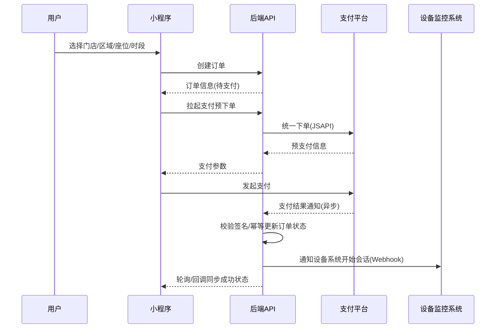
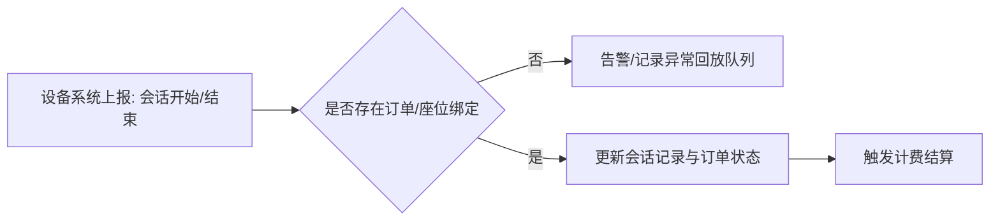
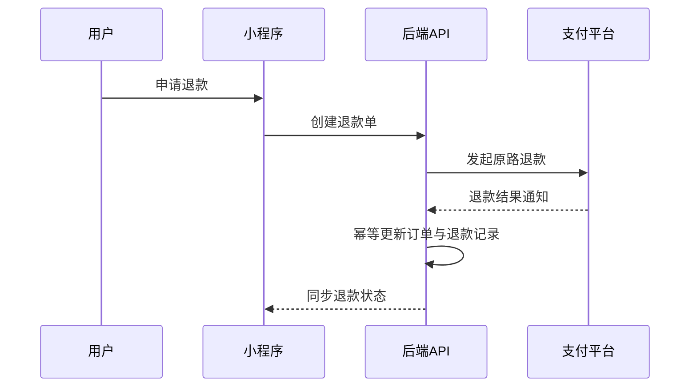

### 核心业务流程

#### 1. 用户下单与支付（小程序）

```mermaid
sequenceDiagram
  participant U as 用户
  participant MP as 小程序
  participant API as 后端API
  participant Pay as 支付平台
  participant Dev as 设备监控系统

  U->>MP: 选择门店/区域/座位/时段
  MP->>API: 创建订单
  API-->>MP: 订单信息(待支付)
  MP->>API: 拉起支付预下单
  API->>Pay: 统一下单(JSAPI)
  Pay-->>API: 预支付信息
  API-->>MP: 支付参数
  MP->>Pay: 发起支付
  Pay-->>API: 支付结果通知(异步)
  API->>API: 校验签名/幂等更新订单状态
  API->>Dev: 通知设备系统开始会话(Webhook)
  API-->>MP: 轮询/回调同步成功状态
```

#### 2. 设备会话同步

```mermaid
flowchart LR
  A[设备系统上报: 会话开始/结束] --> B{是否存在订单/座位绑定}
  B -- 否 --> C[告警/记录异常回放队列]
  B -- 是 --> D[更新会话记录与订单状态]
  D --> E[触发计费结算]
```

#### 3. 退款流程

```mermaid
sequenceDiagram
  participant U as 用户
  participant MP as 小程序
  participant API as 后端API
  participant Pay as 支付平台

  U->>MP: 申请退款
  MP->>API: 创建退款单
  API->>Pay: 发起原路退款
  Pay-->>API: 退款结果通知
  API->>API: 幂等更新订单与退款记录
  API-->>MP: 同步退款状态
```